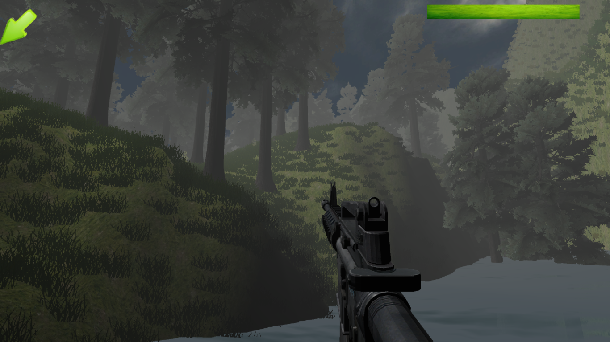
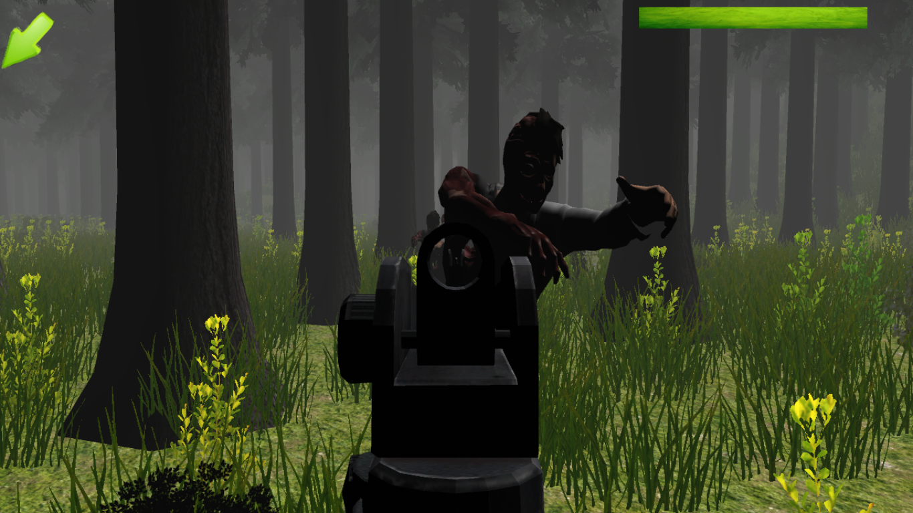
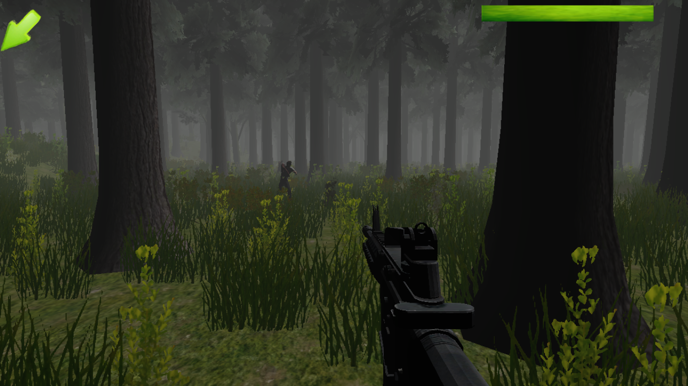
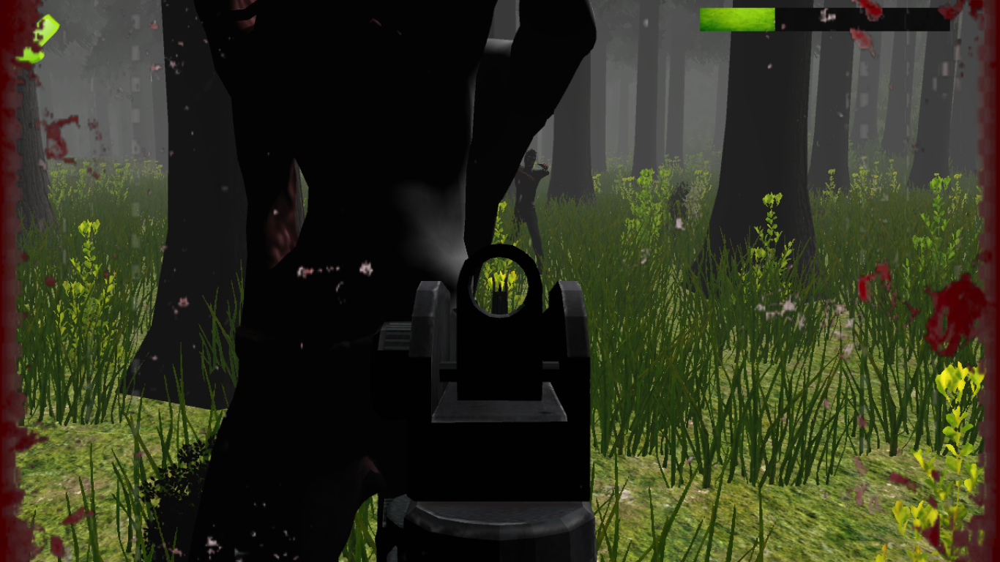

# ZombieHunt

A PC game made in Unity where your mission is to survive, kill zombies, and collect treasures by reaching checkpoints.

## Description

ZombieHunt is an action-packed survival game where players must navigate through challenging environments while fighting off hordes of zombies. The objective is to reach checkpoints to collect treasures while staying alive.

## Features

- First-person shooter gameplay
- Multiple checkpoints with treasures
- Zombie enemies with different behaviors
- Immersive 3D environment
- Treasure collection system

## Screenshots

## Installation

1. Clone this repository
2. Open the project in Unity (recommended version: 2020.3 LTS or newer)
3. Open the main scene from Assets/Scenes
4. Press Play to test the game in the editor

## Controls

- WASD: Movement
- Mouse: Look around
- Left Click: Shoot
- R: Reload
- Space: Jump
- Shift: Sprint

## License

This project is licensed under the MIT License - see the [LICENSE](LICENSE) file for details.

## Contributing

Contributions are welcome! Please feel free to submit a Pull Request.
